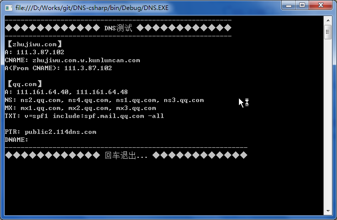

# DNS-csharp的帮助文档

> 本功能主要是升级[DKIM-Smtp-csharp](https://github.com/xiangyuecn/DKIM-Smtp-csharp)时用到的一个MX查询类独立出来的。

## 跑起来

clone下来用vs应该能够直接打开，经目测看起来没什么卵用的文件都svn:ignore掉了（svn滑稽。


## 支持

- 查询A记录
- 查询CNAME记录
- 查询TXT记录
- 查询MX记录
- 查询NS记录
- 查询PTR记录
- 支持扩展别的记录类型查询方法


## 举个例子

``` C#
//查询qq.com的ip(A记录)
var ip=new DNS_A().QueryOne("qq.com").Value; //111.161.64.48

//查询@qq.com的mx记录
var mx=new DNS_MX().QueryOne("qq.com").Value; //mx1.qq.com
```

## 方法文档

### EMail_DKIM.cs

DNS查询的所有功能都在这里面，形式统一为`DNS_XXX`，比如`DNS_A`查询A记录。

`QueryOne(domain, options)`查询返回的第一条数据，比如第一个A记录IP值，如果没有配置相应解析返回错误。

`QueryAll(domain, options)`查询本记录类型的所有值，如果没有配置相应解析，返回空数组。

注：所有查询默认使用标准查询，使用`options` `=` `DNSQueryOptions.BYPASS_CACHE`可忽略缓存。

### DNS_Unit.cs
封装的一些通用方法。都是比较周边的功能。

### Program.cs
控制台入口文件，用来测试的，里面包含了主要的使用用例。


## 扩展查询类型

如果需要查询的类型未实现，但类型在`dnsapi` [DNS Record Types](https://docs.microsoft.com/zh-cn/windows/desktop/DNS/dns-constants)列表内，则可以通过编写相应代码实现扩展。

比如我要实现`DNAME`查询：

1. 新建一个类`DNS_DNAME`，继承自`DNSBase`。
2. 先调用`DNSBase.RegisterType("DNAME", 0x0027)`注册`DNAME`类型。
3. 编写代码，编写一个内部类`DNAME`，内部需要提供的字段参考[查询DNAME返回的数据类型](https://docs.microsoft.com/zh-cn/windows/desktop/api/windns/ns-windns-_dnsrecordw)、[DNS_PTR_DATAW数据结构](https://docs.microsoft.com/zh-cn/windows/desktop/api/windns/ns-windns-__unnamed_struct_3)。
4. 剩余的编写方法可以参考`CNAME`方法。

``` C#
//实现DNS_DNAME查询
public class DNS_DNAME : DNSBase {
	static DNS_DNAME(){
		DNSBase.RegisterType("DNAME", 0x0027);
	}
	
	[StructLayout(LayoutKind.Sequential)]
	private class DNAME : Record {
		public IntPtr pNameHost;
	}

	protected override Type RecordType { get { return typeof(DNAME); } }
	protected override string GetVal(object obj) {
		return Marshal.PtrToStringUni(((DNAME)obj).pNameHost);
	}
}
```


## 相关截图

控制台运行：


